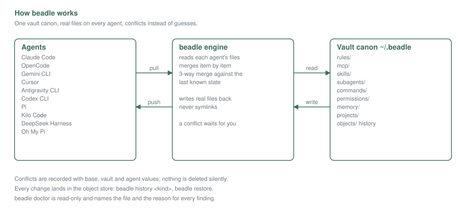
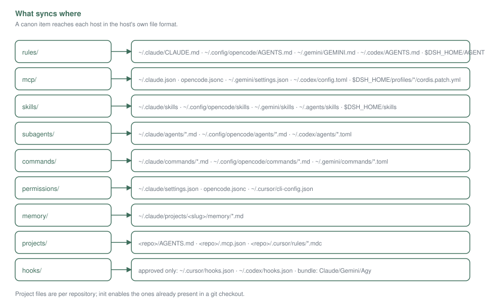

<div align="center">

  <picture>
    <source media="(prefers-color-scheme: dark)" srcset="assets/beadle-dark.svg">
    
  </picture>

  <h1>beadle</h1>

  <p><b>One configuration for every AI coding agent.</b><br>
  Merges, not overwrites — nothing you wrote is deleted without a decision.</p>

  <p>
    <a href="https://github.com/odiumuniverse/beadle/releases"></a>
    <a href="https://github.com/odiumuniverse/beadle/actions/workflows/ci.yml"></a>
    
    
    <a href="https://www.skillsdirectory.com/skills/odiumuniverse-plug-24"></a>
  </p>

</div>

Every agent stores its own instructions, MCP servers, skills and permission rules in its own
format; use two agents, or one agent on two machines, and the same config gets copied by hand and
starts to drift. Beadle keeps that configuration in **a private vault of plain files you own**,
syncs it both ways with a **git-style three-way merge**, and leaves **everything it does not
manage** alone.

Want every agent's whole configuration — rules, memory, skills, subagents, inbox — kept in sync
across machines? You are in the right place. Only need plugins, without the rest?
→ [verger](https://github.com/odiumuniverse/verger), the plugin manager beadle embeds.

```
~/.beadle/                  your vault — the only thing you edit
├── rules/base.md               your rules and instructions
├── mcp/servers.json            MCP servers (canonical, portable form)
├── mcp/secrets.json            credential values (0600, never committed)
├── skills/<name>/              skills, whole trees
├── subagents/<name>.md         custom subagents
├── commands/<name>.md          custom commands / prompt templates
├── permissions/rules.json      permission policy (on by default)
├── memory/<slug>/              Claude per-project notes
├── projects/<repo-id>/         per-repository files and policy
├── objects/                    content-addressed history
└── state.json                  sync state: per-agent bases, conflicts, snapshots
        ▲                             │
        │  pull changes               │  push changes
   ┌────┴─────┬───────────┬───────────┴────┐
 Claude Code  OpenCode   Gemini CLI     Cursor
  + Antigravity CLI + Codex CLI + Pi + Kilo Code + oh-my-pi (omp)
```

[Why use it](#why-use-it) · [Supported agents](#supported-agents) · [Install](#install) ·
[Quick start](#quick-start) · [Guides](#guides) · [Plugins](#plugins) ·
[Reference](#reference) · [Commands](#commands) · [Project scope](#project-scope) ·
[Secrets](#secrets) · [Exit codes](#exit-codes) · [beadle and verger](#beadle-and-verger)

## Guides

- **[For AI agents](guide/ai-agents.md)** — the rules, defaults, plugin flow and workflow an agent
  needs to work with the vault safely. `beadle guide` prints the same document from the binary.
- **[For humans](guide/humans.md)** — quick start, what syncs where, plugins, conflicts, secrets
  and FAQ. `beadle guide --humans` prints it.





## Why use it

- **One config, several agents.** Edit rules, servers or skills in whichever agent you are in — or
  directly in the vault — and the rest follow.
- **Merges, not overwrites.** Three-way merges against each agent's last known state; disagreement
  becomes an explicit conflict, not a silent loss.
- **Multiple machines.** The vault is a directory: put it in git (or your own sync) and every
  machine shares the same canon. Credential values stay out.
- **Your repository is respected.** Project scope is leak-aware: `init` enables the files already
  present in a git checkout, secret values only land in gitignored files (a tracked file needs an
  explicit per-file opt-in), generated blocks skip tracked files, and unmanaged entries are never
  rewritten.

## Supported agents

Ten agents, named the same way everywhere: `claude`, `codex`, `gemini`, `agy`, `cursor`,
`opencode`, `kilo`, `pi`, `dsh`, `omp`. If you have been using an older name, it still works
wherever you type one — `claude-code` is accepted for `claude`, `gemini-cli` for `gemini`,
`antigravity-cli` for `agy` and `deepseek-harness` for `dsh`.

| Agent | Rules | MCP | Skills | Permissions | Subagents | Commands |
|---|---|---|---|---|---|---|
| Claude Code | ✓ `~/.claude/CLAUDE.md`, plus the project `AGENTS.md` | ✓ `~/.claude.json` | ✓ writes `~/.claude/skills` | ✓ on by default | ✓ `~/.claude/agents/**` | ✓ `~/.claude/commands` |
| OpenCode | ✓ `~/.config/opencode/AGENTS.md` | ✓ `opencode.jsonc` | reads Claude and shared dirs natively | ✓ on by default | ✓ `~/.config/opencode/agents` | ✓ `~/.config/opencode/commands` |
| Gemini CLI | ✓ `~/.gemini/GEMINI.md` | ✓ `settings.json` | ✓ `~/.gemini/skills` | ✓ shell rules | ✓ `~/.gemini/agents` | ✓ `~/.gemini/commands/*.toml` |
| Cursor | Cursor keeps user rules in your account; project rules are `.cursor/rules/*.mdc` | ✓ `~/.cursor/mcp.json` | reads Claude and shared dirs natively | ✓ shell and MCP | ✓ `~/.cursor/agents` | Cursor has no user-level command file |
| Antigravity CLI (`agy`) | uses the Gemini CLI rules file | ✓ `~/.gemini/config/mcp_config.json` | — | Antigravity's own dialect is not a file | ✓ `~/.gemini/config/agents` | Antigravity has no command file |
| Codex CLI | ✓ `~/.codex/AGENTS.md` | ✓ `~/.codex/config.toml` | reads `~/.agents/skills` natively | Codex's approval policy is set in its own config | ✓ `~/.codex/agents/*.toml` | ✓ pull-only `~/.codex/prompts` |
| Pi | ✓ `~/.pi/agent/AGENTS.md` | ✓ `~/.pi/agent/mcp.json` | reads `~/.agents/skills` natively | Pi has no permission document | Pi has no sub-agents | ✓ `~/.pi/agent/prompts` |
| Kilo Code | ✓ `~/.config/kilo/AGENTS.md` | ✓ `kilo.jsonc` | reads `~/.agents/skills` natively | ✓ on by default | ✓ `~/.config/kilo/agents` | ✓ `~/.config/kilo/commands` |
| DeepSeek Harness (`dsh`) | ✓ `~/.dsh/AGENTS.md`, plus the project `AGENTS.md` / `CLAUDE.md` chain | ✓ `~/.dsh/cordis.patch.yml` | ✓ `~/.dsh/skills` | DSH keeps these in runtime state, not files | DSH subagents are code providers | DSH commands are plugin code |
| oh-my-pi (`omp`) | ✓ `~/.omp/agent/AGENTS.md`, plus `<cwd>/.omp/AGENTS.md` | ✓ `~/.omp/agent/mcp.json`, plus `<cwd>/.omp/mcp.json` | reads `~/.agents/skills` natively | omp keeps approval policy in its own `config.yml` | ✓ `~/.omp/agent/agents` | ✓ `~/.omp/agent/commands` |

A ✓ means beadle writes that surface. `reads …` means the agent reads a shared skills directory
itself (`~/.claude/skills`, `~/.agents/skills`); those skills surfaces start in `pull` mode, so
beadle reads them without writing the agent's own directory. Flip one with
`beadle agents mode <agent> <kind> sync`. The shared `~/.agents/skills` hub is enabled by
`beadle init`; opt out with `beadle agents disable shared`.

Beadle creates a surface only where it is safe to: the rules and skills files of Claude Code,
Gemini CLI, DeepSeek Harness and oh-my-pi, the Codex `config.toml`, the DeepSeek Harness
`cordis.patch.yml`, the subagent and command directories listed above, and the shared
`~/.agents/skills` directory. Every other surface is written only when its config file already
exists — an agent found by its directory alone is skipped with `no config file to write into;
create <path> first` until the file appears, and an empty file is enough.

A few things worth knowing:

- **Flat skills.** OpenCode, Pi and DeepSeek Harness also read a `<name>.md` file in their own
  skills directory as a skill named by the file. Beadle adopts such copies into the canon and
  keeps delivering directories; when a same-name directory exists it wins, and `doctor` reports
  both.
- **Permissions.** Beadle can apply Claude Code, Kilo Code and OpenCode (tools, shell and MCP),
  and shell rules for Gemini CLI and Cursor. The permissions kind is on by default; opt out with
  `beadle kinds disable permissions`.
- **Pi's MCP file** is read only by the third-party `pi-mcp-adapter`. `doctor` warns when managed
  servers are present and the adapter is not installed.
- **Codex prompts** are deprecated by Codex itself: beadle pulls them into the vault and never
  writes them back.
- **Subagents** are one markdown canon, `<vault>/subagents/<name>.md`. OpenCode and Kilo Code get
  a strict frontmatter shape; Codex files are edited surgically so comments and your own keys
  survive. oh-my-pi requires `name` and `description`, and its own keys stay in the file.
- **Commands** are one markdown canon too. Beadle shifts positional arguments between Claude's
  0-based `$0` and the 1-based canon, translates Gemini's `{{args}}` syntax, and skips a host
  whose dialect cannot express a placeholder — `doctor` explains which.
- **oh-my-pi is not Pi.** Its user root is `~/.omp`, and `PI_CONFIG_DIR` names the root under your
  home (an absolute value is joined below it, not resolved as-is), `PI_CODING_AGENT_DIR` the
  agent dir, `OMP_PROFILE` a named profile, and the older `PI_PROFILE` only when `OMP_PROFILE` is
  not set at all. omp does not read `~/.pi`.
- **omp hooks are JS/TS modules, not a declarative file.** Beadle copies the modules a plugin
  ships, byte for byte, into the active agent's `hooks/` directory — but only after you run
  `beadle hooks approve --plugin <key>`, and the consent key carries the module's digest, so a
  changed module asks again. Those bytes come from a plugin beadle did not audit and omp neither
  sandboxes a hook module nor asks for trust, so **restart omp** after a delivery: a live session
  keeps running the modules it loaded at start.

## Install

**macOS or Linux** — Homebrew:

```bash
brew tap odiumuniverse/tap
brew trust odiumuniverse/tap
brew install beadle
```

The formula serves the macOS build on macOS, and on Linux the native `arm64`
or `amd64` one, so the same three commands work with Linuxbrew.

**macOS or Linux** — build from source (needs the Go toolchain):

```bash
git clone https://github.com/odiumuniverse/beadle.git
cd beadle
go build -o beadle ./cmd/beadle
```

The module is `github.com/odiumuniverse/beadle` and the binary is `beadle`. It needs a writable
home for the vault (`~/.beadle`, or `$BEADLE_HOME`).

To keep the watcher running in the background, install it as a service — `launchd` on macOS, a
`systemd` user unit on Linux:

```bash
beadle daemon install
```

Homebrew does not start services on install, so on macOS you can also use
`brew services start beadle`; it serves the default vault `~/.beadle`, while `beadle daemon
install` also works for a custom vault.

## Quick start

```bash
beadle init                 # create the vault, enable detected agents, wire the defaults
beadle sync                 # pull every agent into the vault, push the union back
beadle status               # resources, conflicts, agents
beadle diff                 # what a sync would change, item by item
beadle conflicts            # what waits for a decision
beadle doctor               # symlinks, permissions, drift, collisions
```

`beadle init` wires the defaults on a fresh machine: detected agents are enabled, the native
bundles of detected hosts are rendered and registered (a host without its CLI gets the
registration command instead and keeps file sync), the present project files of a git checkout are
enabled with secrets kept out, and the background watcher is installed unless one is already there.
`--no-daemon` skips the watcher, `--daemon` reinstalls it, and `--agents a,b` restricts which
agents are enabled.

Run it continuously:

```bash
beadle watch                # foreground watcher
beadle daemon install       # launchd (macOS) / systemd user unit (Linux)
```

Your first run against an older vault tells you what it renamed and applies the change the first
time a command saves the config; every one of those defaults can be switched off again — `beadle
kinds disable permissions`, `beadle agents disable shared`, `beadle hooks revoke <name>`, `beadle
bundles disable <host>`.

## Plugins

beadle manages plugins through [verger](https://github.com/odiumuniverse/verger), which is built
into the binary: `beadle bundles` renders your canon as a native package and registers it with the
host's own CLI, and `beadle plugins pin` holds a version per agent.

Installing plugins from your shell with the standalone [verger](https://github.com/odiumuniverse/verger)
CLI gives the same result — beadle delivers plugins through verger, so a package installed either
way lands identically and `beadle status` sees both. Switching between the two tools changes
nothing on disk: neither rewrites what the other wrote.

## Reference

What beadle manages, one line per kind.

<details>
<summary><b>Rules and instructions</b> — one markdown canon rendered into every agent's rules file</summary>

`CLAUDE.md`, `AGENTS.md`, `GEMINI.md`. *Why:* the thing agents read first is usually the thing most
out of date.

</details>

<details>
<summary><b>MCP servers</b> — one portable canonical form; agent-only fields survive every rewrite</summary>

`mcp/servers.json` renders into each agent's own document and dialect. Credential values are
replaced with references; see [Secrets](#secrets).

</details>

<details>
<summary><b>Skills</b> — whole directory trees, not single files</summary>

`skills/<name>/` is delivered as a tree so a skill keeps its references.

</details>

<details>
<summary><b>Subagents</b> — one markdown canon per subagent</summary>

`subagents/<name>.md`, rendered into each host's own frontmatter dialect.

</details>

<details>
<summary><b>Commands</b> — one markdown canon per slash command</summary>

`commands/<name>.md`, with argument placeholders translated per host.

</details>

<details>
<summary><b>Permissions</b> — tools, shell and MCP policy, on by default</summary>

`permissions/rules.json`. Opt out with `beadle kinds disable permissions`.

</details>

<details>
<summary><b>Memory</b> — Claude per-project notes</summary>

`memory/<slug>/`, kept per project rather than merged into one canon.

</details>

<details>
<summary><b>Project files</b> — per-repository configuration</summary>

See [Project scope](#project-scope).

</details>

## Commands

| Command | What it does |
|---|---|
| `init [--agents a,b] [--no-daemon] [--daemon]` | create the vault, enable detected agents, wire the defaults |
| `sync [--dry-run] [--kind k]` | full cycle: pull, merge, push |
| `pull` / `push` | one direction only (`push` overwrites local agent edits) |
| `status [--check]` / `diff [--agent id]` | agents, modes and conflicts / what a sync would change (`--check` also computes pending changes) |
| `conflicts [id]` | open conflicts; with an id, the variants |
| `resolve [id…] --take vault\|agent\|file` | settle conflicts and push the decision |
| `history <kind>` / `restore <kind> --to N` | snapshots and rollbacks |
| `doctor` | diagnostics; non-zero exit on errors |
| `migrate` | upgrade the vault's stored schemas to the current version |
| `agents` (`enable` / `disable` / `mode`) | agents and their per-kind directions |
| `kinds` (`enable` / `disable`) | switch kinds on or off for every agent |
| `watch` / `daemon` | background sync and the autostart service |
| `secrets list\|set\|rm\|prune\|migrate` | credential values; never printed |
| `plugins list\|install\|remove` | plugin packages, delivered by the embedded plugin manager |
| `plugins canon enable\|disable` | install beadle's canon as a plugin package on every host, or remove it |
| `plugins pins\|pin\|unpin` | per-agent plugin version pins |
| `plugins eject` | move the plugin home out of the vault to `~/.verger`, keeping the packages |
| `bundles status\|enable\|disable` | native host bundles and their registration |
| `hooks list\|add\|rm\|approve\|revoke` | lifecycle hooks, rendered into host hook files and bundles — beadle never runs them |
| `skills seed\|adopt\|unadopt` | the built-in skills, foreign-copy adoption and its restore |
| `explain <skill>` | which copy of a canon skill each host can read |
| `export agent-plugins --out DIR` | render the canon (skills + MCP) as an Agent Plugins package |
| `rulings list\|show\|trust\|forget` | remembered conflict decisions, applied only on an exact match |
| `project status\|enable\|disable\|forget` | per-repository project scope |
| `guide [--humans]` | print the guide for AI agents, or the human guide |

Global flags: `--vault` (default `~/.beadle`, or `$BEADLE_HOME`), `--verbose`, `--log-json`.

## Project scope

`beadle init` in a git checkout enables the project files that are present on disk, with secrets
kept out; `beadle project enable <file>` records a file manually, and `beadle project
status|disable|forget` manages the policy. Without a policy (or outside a git checkout) nothing in
a repository is touched; `doctor` keeps reporting foreign `.mcp.json` / `projects.*` collisions.
Secret values materialize only in gitignored files; a git-tracked file needs the explicit per-file
opt-in (`beadle project enable <file> --allow-secrets`).

The files are `.mcp.json`, `.claude/rules/*.md`, `.cursor/mcp.json`, `.cursor/rules/*.mdc`,
`.agents/mcp_config.json`, `.omp/AGENTS.md`, `.omp/mcp.json`, `AGENTS.md` and `GEMINI.md`. Project
identity comes from the git origin, so clones and worktrees converge; a missing file is never
treated as a deletion — `project forget` removes scope, a sync never does.

## Secrets

The gate extracts credential values out of the canon into `mcp/secrets.json` (0600, never
committed) or the OS keyring (`beadle secrets migrate keyring`); files carry `{secret:NAME}`
references, and shareable files render `${NAME}` instead of a value. The keyring backend is
fail-closed: an unavailable keyring yields skips and warnings, never a plaintext fallback.

## Principles

- **Real files, symlinks respected.** Beadle never creates symlinks and never replaces yours: a
  write goes through a link to its target; broken links are reported by `doctor`. Project files are
  stricter — a symlink, a hard link or a non-regular file is refused.
- **Nothing is deleted silently.** Deletions propagate only relative to each agent's own base,
  mass deletions wait as conflicts, and project files that disappear (a branch switch, `git clean`)
  are reported as `kept`, not removed.
- **Atomic writes.** tmp file + fsync + rename in the target directory, then fsync of the
  directory; the file mode is preserved.
- **Local stays local.** OAuth state, hooks, plugins, UI settings, folder trust — untouched.
  Secrets never reach the synced canon, the object store or git history.

## Exit codes

beadle and verger use the same classes, so a script can treat them alike.

| code | name | meaning |
|---|---|---|
| 0 | ok | success |
| 1 | unexpected | an error with no more specific class |
| 2 | usage | wrong flag, wrong argument, unknown command |
| 3 | conflict | a conflict only you can settle: a `sync` that ended with one open, or a watcher that already holds the lease |
| 4 | policy refusal | a managed-settings policy forbids this |
| 5 | consent needed | a package needs approval before it runs |
| 6 | host unavailable | the host cannot be reached or has no schema |
| 7 | schema newer | the spec was written by a newer version |

## beadle and verger

beadle is a coding agent's own configuration — rules, memory, skills, subagents, inbox, vault — and
it uses verger as its plugin manager, embedded, so the two share one spec, one lock and one set of
exit codes. Use beadle when you want an agent's behaviour managed along with its plugins, and
verger on its own when you only want plugins.

They are the same program underneath, which is what makes the two arrangements safe to combine:

- **One home.** `~/.beadle` and `~/.verger` are read by both. What beadle writes to an agent,
  standalone `verger` sees, and the package set each of them reports is the same set.
- **One watcher.** `beadle watch` and `verger watch` take the same lease. The second one does not
  compete: it says which watcher holds it and by which pid, and exits 3. Run whichever you prefer;
  do not run both.
- **Eject.** `beadle plugins eject` moves the plugin home out of the vault to `~/.verger`, keeping
  every installed package. From then on `verger status`, `verger sync` and the rest work on it
  directly, with everything else in `~/.beadle` untouched — and the two can still be run on the
  same home, because after the eject there is one plugin home, not two.
- **Absorb.** The other direction needs no command: `beadle init` moves a standalone `~/.verger`
  into the vault, file for file, and the old directory is gone afterwards. After that there is one
  plugin home again — inside the vault — and `beadle plugins eject` sends it back out.

## License

MIT.
