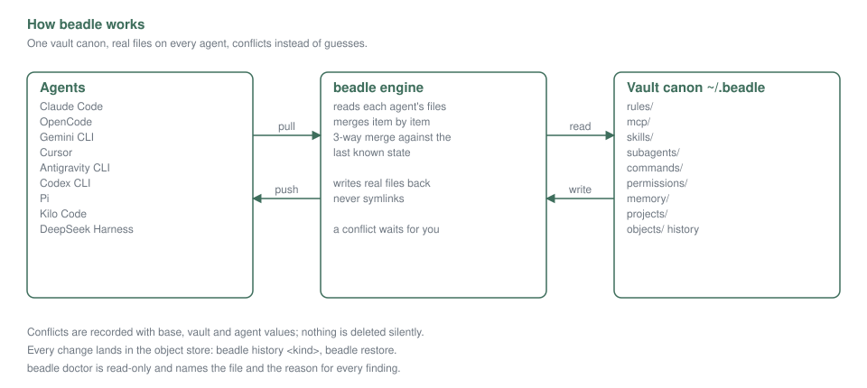
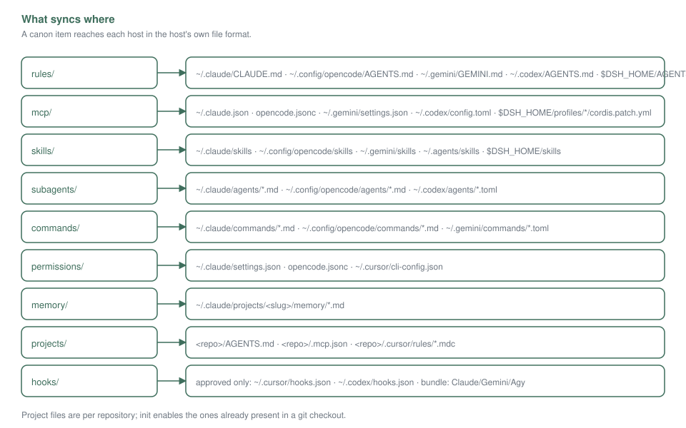
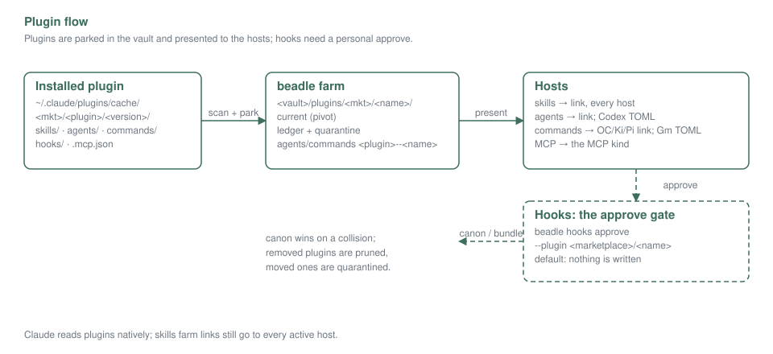
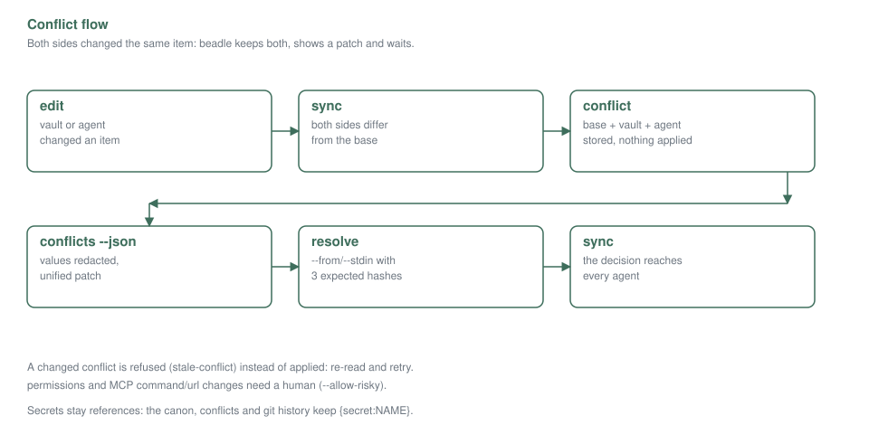

# beadle — guide for humans

beadle keeps one configuration for every AI coding agent you use. You edit your
rules, MCP servers, skills, subagents, commands, permissions or memory **once**,
in a directory you own (the *vault*, by default `~/.beadle`), and beadle keeps
the agents in sync: Claude Code, OpenCode, Gemini CLI, Cursor, Antigravity,
Codex, Pi and Kilo.

It writes real files, merges each item with a 3-way merge against the last known
state of every agent, and when two sides changed the same item it records a
**conflict** instead of guessing. Nothing is deleted silently.



## Quick start

```sh
beadle init            # create the vault, enable the agents found here
beadle status          # kinds, agents, conflicts
beadle diff            # what a sync would change (read-only)
beadle sync            # pull → merge → push
beadle doctor          # diagnose: drift, refusals, hooks, bundles
```

Install and the full matrix live in the [README](../README.md). `beadle guide`
prints the machine-facing version of this document; `beadle guide --humans`
prints this one.

## What syncs where

```
        vault (~/.beadle)                     agents
  rules/         ──┐                 ┌── ~/.claude/CLAUDE.md
  mcp/           ──┤                 ├── ~/.config/opencode/AGENTS.md, opencode.jsonc
  skills/        ──┤   beadle        ├── ~/.gemini/GEMINI.md, settings.json, skills/
  subagents/     ──┼── engine ───────┼── ~/.cursor/mcp.json, agents/
  commands/      ──┤  (3-way merge,  ├── ~/.codex/AGENTS.md, config.toml, agents/*.toml
  permissions/   ──┤   conflicts)    ├── ~/.pi/agent/AGENTS.md, mcp.json
  memory/        ──┤                 ├── ~/.config/kilo/AGENTS.md, kilo.jsonc
  projects/      ──┘                 └── ~/.agents/skills (shared)
  objects/  history, state.json  state
```



A canon item is the source of truth for the agents that can express it; fields
a host cannot express stay in the vault and are reported by `beadle doctor`.
Project files (`AGENTS.md`, `.mcp.json`, `.cursor/rules/*.mdc`, …) are managed
per repository, and `beadle init` enables the ones already present in a git
checkout — secrets in project files need an explicit opt-in
(`beadle project enable --allow-secrets`).

## Plugins

Installed Claude plugins are scanned and **parked** in the vault, then
presented to the active hosts. Skills arrive as links in every host's skills
directory (Claude included, next to its native plugin copy). Subagents and
commands arrive as links for the md hosts; Codex gets rendered TOML subagents,
Gemini rendered TOML commands, Claude reads both natively and Codex commands
are skipped (`prompts` is pull-only). MCP servers are merged into the MCP kind.
Subagent and command names are namespaced `<plugin>--<name>`; skills and MCP
servers keep their own names. Your canon wins on a collision, then the first
plugin by key; removed plugins are pruned and moved ones are quarantined with a
stub.

**Hooks are different: they never travel by themselves.** beadle scans plugin
command hooks, reports them in `beadle doctor`, and writes nothing until you
approve them yourself:

```sh
beadle hooks approve --plugin <marketplace>/<name>
```

beadle never executes hooks. The Claude bundle is excluded (Claude runs its own
plugin hooks natively); non-command hooks are skipped with a warning.



## Conflicts

A conflict appears when the vault and an agent both changed the same item since
the last sync (or when both were edited while beadle was not looking). beadle
stores both sides plus the base, shows a unified patch, and waits.

```sh
beadle conflicts                 # list what is open
beadle conflicts <id> --json     # values (secret-redacted) + patch
beadle resolve <id> --take vault # keep the vault value
beadle resolve <id> --take agent # take the agent value
# or resolve with your own merged content:
beadle resolve <id> --from merged.md \
  --expect-base <base> --expect-vault <vault> --expect-agent <agent>
beadle sync
```

The three `--expect-*` hashes come from the same `--json` read; if the conflict
changed in between, the resolution is refused as `stale-conflict` instead of
applied. `permissions` and MCP `command`/`url` changes need a human
(`--allow-risky`).



## Secrets

Values live in `~/.beadle/mcp/secrets.json` (mode 0600, never committed) and in
the environment; the canon, the objects, the conflicts and the git history keep
only `{secret:NAME}` references. A sync materializes the values into the host
configs that need them (that is what the host reads); `beadle export` keeps the
references unexpanded and never prints values.

## Doctor and troubleshooting

`beadle doctor` is read-only and prints one line per finding: conflicts,
refused resolutions, drifting or refused files, unapproved plugin hooks,
bundle state, skill coverage/shadows, dangling skill references, secret-like
lines in kinds the gate does not scan (rules, subagents, commands), and more.
Common answers:

- **A file is not synced.** `beadle diff` shows it; if the agent's kind is
  `pull`, only the agent writes there. `beadle kinds` lists the modes.
- **The agent did not keep what beadle wrote.** The host cannot express it (a
  field, a placeholder, a tool); the doctor note names the reason.
- **A skill is missing.** Check `beadle explain <skill>` for the copies the
  host sees and which one wins.
- **The bundle is not active.** `beadle bundles` shows the host state; without
  the host binary the bundle stays `unverifiable` and modes are not flipped.

## FAQ

**Where is my vault?** `$BEADLE_HOME` or `~/.beadle` (`beadle status` prints
it). It is a directory: put it in git or your own sync and every machine shares
the canon — credential values stay out.

**Why do I see both `AGENTS.md` and `CLAUDE.md`?** Agents have different
instruction files; beadle writes each host its own file from the same canon.
A host that reads another agent's file natively (for example OpenCode reading
`~/.claude/skills`) is marked `pull` and beadle does not duplicate it.

**How do I disable something?** `beadle kinds disable <kind>`,
`beadle agents disable <agent>`, `beadle project disable <file>`,
`beadle bundles disable <host>`.

**How do I update?** Install the new binary and run `beadle sync`; the vault
and `state.json` are forward-compatible. `beadle daemon install` refreshes the
watcher.

**Something looks wrong.** Run `beadle doctor` first; it names the file and the
reason. Nothing is deleted silently, and every change is in the vault's object
store (`beadle history <kind>`, `beadle restore`).
